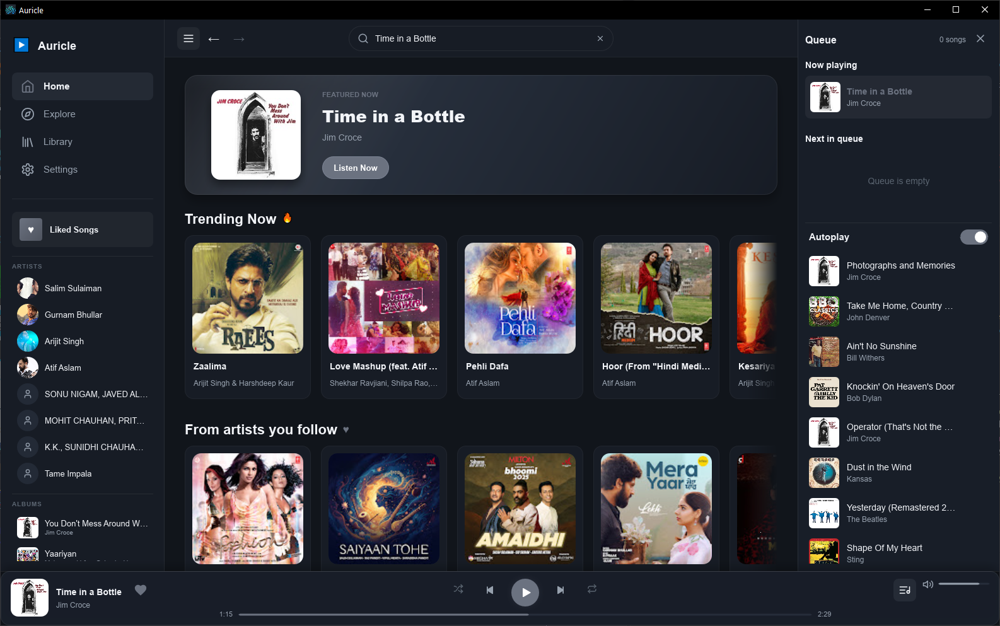

# Auricle

Auricle is a native desktop music player for Windows, built with **Rust** and the
**[Slint](https://slint.dev/)** UI toolkit. Search the YouTube Music catalogue,
organize your local library, and keep listening with a queue, autoplay, and an
audio cache. The app runs in a native shell with no Electron or embedded web view.

[](https://sourceforge.net/projects/auricle/files/latest/download)



## Features

- Search songs, albums, artists, and playlists with suggestions and mixed previews.
- Browse artist and album pages, save albums and playlists, and follow artists locally.
- Use right-click menus to navigate artist and album credits or manage the queue.
- Play, pause, seek, adjust volume, and keep listening with queue and autoplay controls.
- Keep liked songs and listening history on your device.
- Reuse recently played audio with a size-limited local cache (500 MB by default).
- Minimize to the Windows system tray while playback continues.

## Download

Get the Windows installer or portable ZIP from [GitHub Releases](https://github.com/californiaAlmonds/auricle/releases/latest).
Downloads are also mirrored on [SourceForge](https://sourceforge.net/projects/auricle/files/).

## Status

Version 0.1.4 is an early Windows release. Streaming depends on external services
and optional add-ons, and availability can change. Auricle is not affiliated with
YouTube or Google. The only supported UI is the native Slint shell.

## Essential add-ons (yt-dlp & ffmpeg)

Auricle does **not** bundle or redistribute third-party media tools. Audio
extraction relies on [`yt-dlp`](https://github.com/yt-dlp/yt-dlp), and some cache
operations use [`ffmpeg`](https://ffmpeg.org/). On first run, Auricle offers an
optional **"Install essential add-ons"** step that can download these tools into a
per-user application directory.

Installing them is entirely at your own discretion and choice. You may also install
them yourself and make them available on your `PATH`. Auricle will detect existing
installations and skip them.

These tools are licensed by their respective authors; Auricle is not affiliated with
them and does not distribute them.

## Prerequisites

- [Rust](https://www.rust-lang.org/tools/install) (edition 2021, Rust ≥ 1.77.2)
- Windows with the MSVC C++ Build Tools
- (Optional) `yt-dlp` and `ffmpeg`, installed via the in-app add-on step or manually

## Build & Run

The project is driven by Cargo through convenience npm scripts:

```bash
# Debug build
npm run build

# Run the native shell
npm run run

# Release build
npm run release
```

Equivalent direct Cargo commands:

```bash
cargo run --bin auricle
```

## Architecture

- `ui/native_shell.slint` — Slint UI: layout, callbacks, and state.
- `src/lib.rs` — `run_native_shell()` wires UI callbacks to backend logic.
- `src/core/bridge.rs` — shared `PlaybackCore` singleton.
- `src/core/playback.rs` — queue, history, likes, and the playback worker.
- `src/core/stream_player.rs` — HTTP/range streaming audio source.
- `src/core/cache.rs` — LRU on-disk audio cache.
- `src/core/search.rs` — search client with result caching and catalogue enrichment.
- `src/search_ui.rs` — debounced, cancellable search worker wired to the UI.
- `src/context_ui.rs` — unified song/album/artist right-click context menus.
- `src/core/menu_metadata.rs` — artist/album credit resolution for context menus.

## Technologies

- **UI**: Slint
- **Language / runtime**: Rust, Tokio
- **Audio**: rodio + symphonia (decode/playback)
- **Music API**: `ytmapi-rs`
- **Local storage**: JSON metadata and an on-disk audio cache

## Contributing

Contributions follow a `feature → release/x.y.z → main` branch model with
CI-enforced versioning and protected branches. Before opening a pull request,
read [CONTRIBUTING.md](CONTRIBUTING.md) for the branch model, release process,
and rules. Developers using GitHub Copilot can rely on
[.github/copilot-instructions.md](.github/copilot-instructions.md) for project
conventions.

## License

Auricle is free software, licensed under the **GNU General Public License v3.0**.
See [LICENSE](LICENSE) for the full text.

Auricle uses the Slint UI toolkit under its GPLv3 licensing option. Third-party
tools such as `yt-dlp` and `ffmpeg` are not distributed with Auricle and remain
under their own respective licenses.
